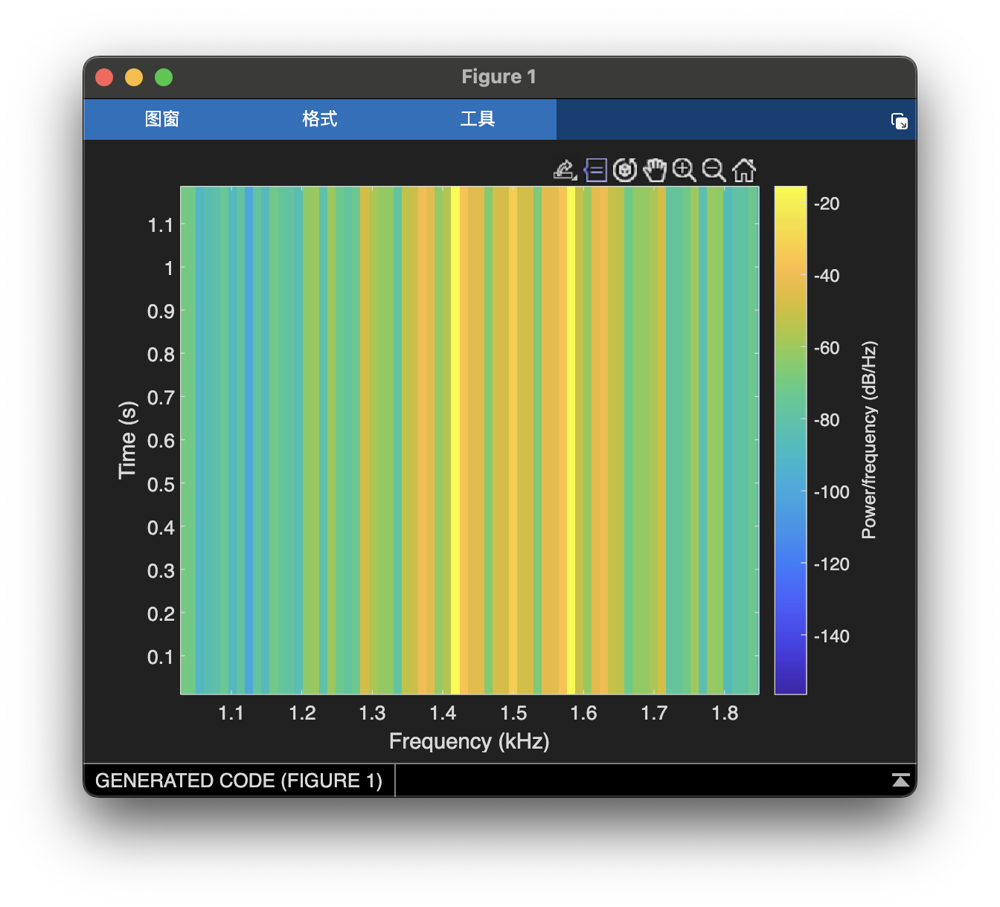
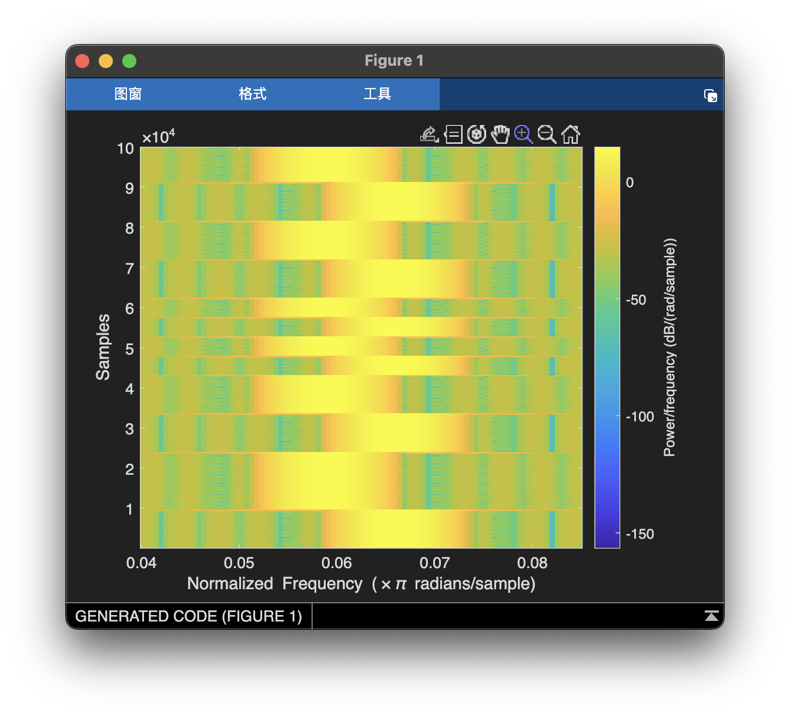
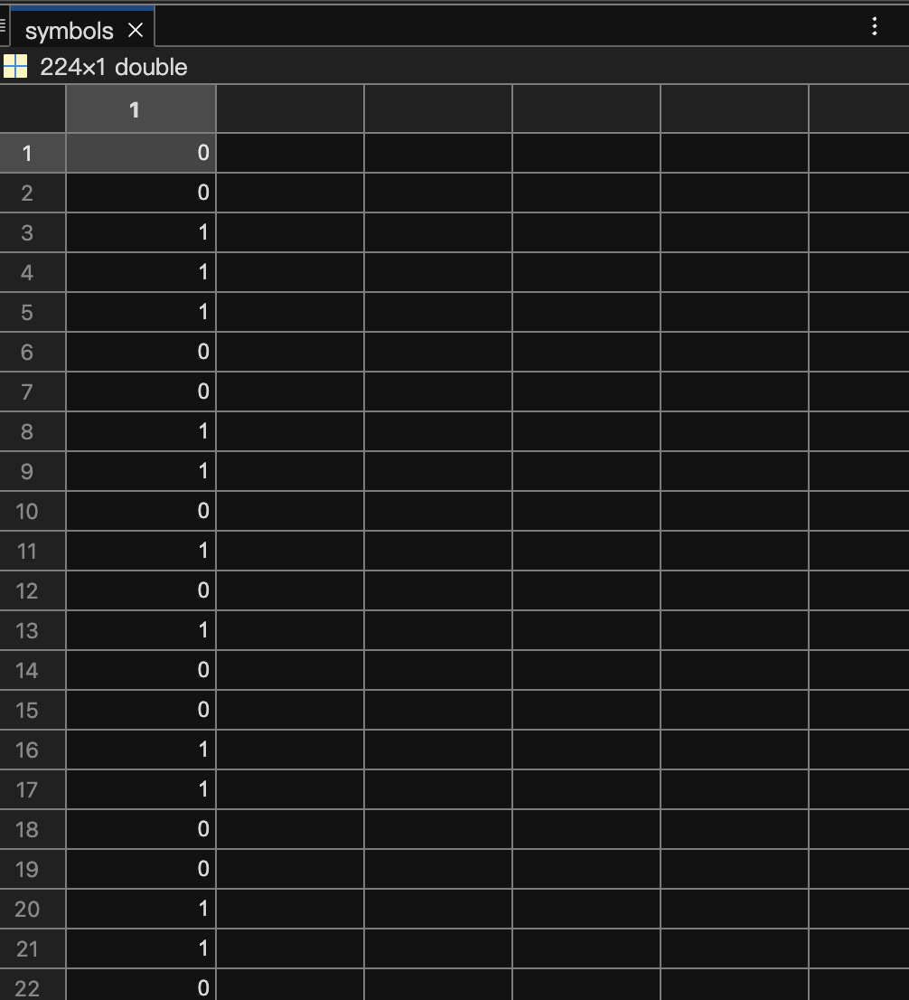
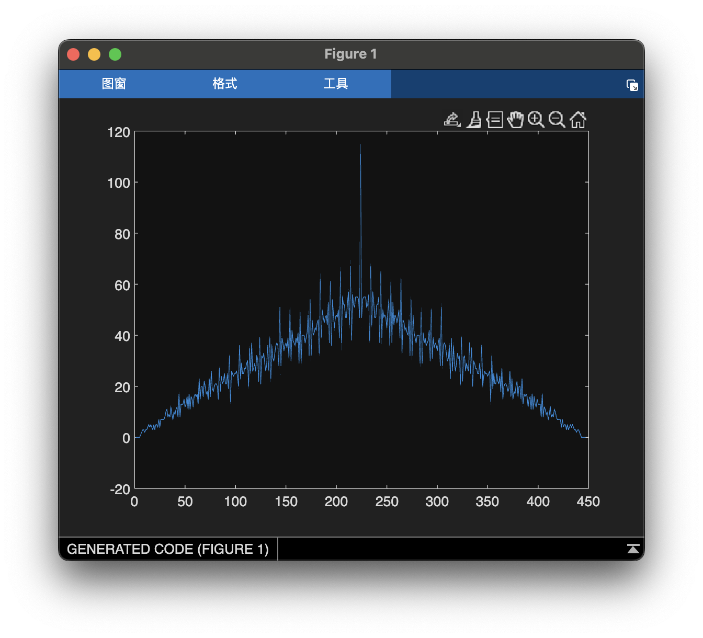
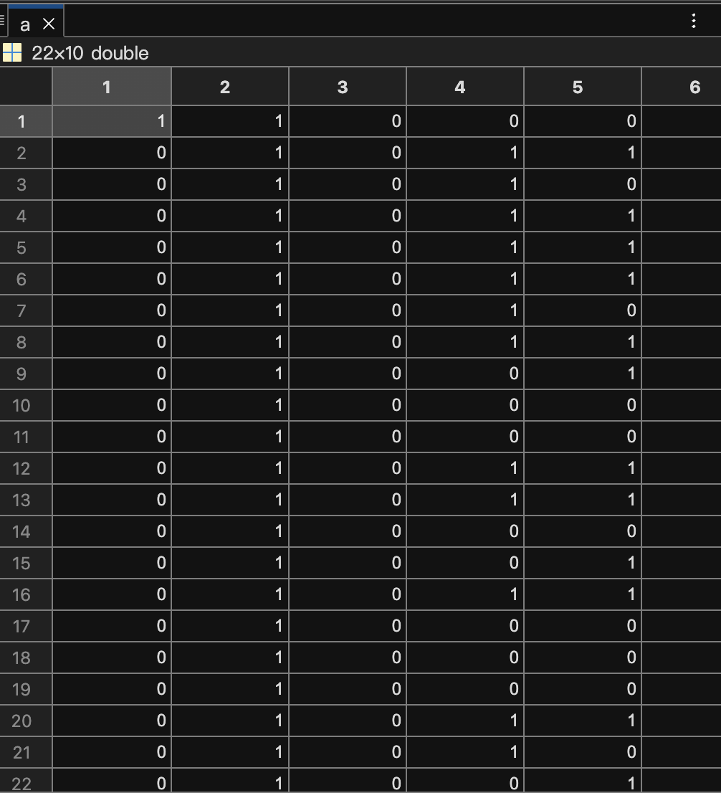
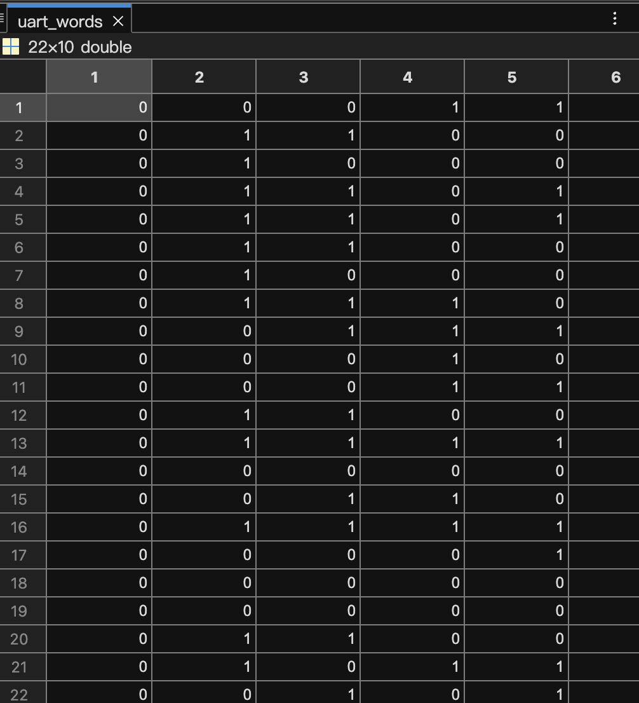
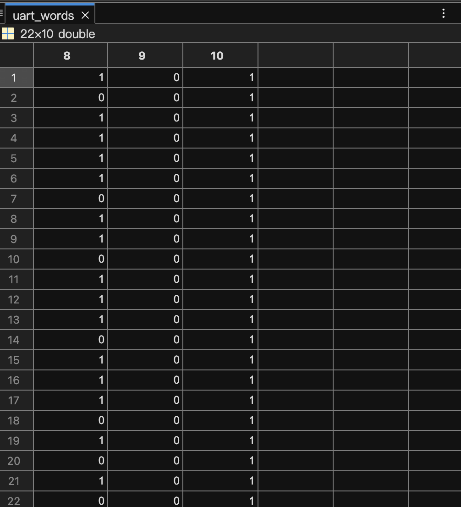

# Communication Gateway Writeup

---

### Description

Something is in-front of you, and you don't even know it.

---

### Writeup

We are provided with a .wav file sampled at 48kHz. This means it is possible that there is audible frequencies in the signal. Indeed if you play it you can clearly hear at least two different frequencies, indicating some sort of FSK modulation. It sounds sort of like an old dial up modem (in fact that's sort of what it is, but I didn't know that until after solving it).

Let's take a look at the spectrogram. *\*opens up Matlab\**



Taking a spectrogram over the whole signal we see that there are two very prominent frequencies in the signal, roughly 1.41kHz and 1.59kHz. Let's take another spectrogram with a window of 500 samples.



Would you look at that, nice binary FSK, with the smallest division being about 4800 samples. 4800 happens to be a nice multiple of the sampling rate, which is a good sign. So let's write a quick and dirty FSK demodulator.

```matlab
% Read in the samples
% 48kHz sample rate
samples = audioread("file10.wav");

% Reserve space for the symbols we'll be demodulating
symbols = zeros(length(samples) / 4800, 1);
for i = 1:length(symbols)
    % Take the 4800 point fft of this 4800 sample segment
    freqs = abs(fft(samples(1 + (i - 1) * 4800:i * 4800)));
    % Pick out the highest frequency
    best_freq = find(freqs == max(freqs), 1);
    % With two frequencies there are two ways to encode a 1 bit
    % I guessed that the highest of the two would be a 1.
    if best_freq == 159
        % Corresponds to the higher freq we saw (~1.6kHz) because:
        % 159 * 48000 / 4800 = 1590.
        % 48000 is the sample frequency and 4800 is the fft size
        % The idea here is the fft says it happens 159 times per 
        % 4800 samples, so we need to figure out how mny times
        % 4800 samples occurs per second which is the same as
        % how many times 4800 samples occurs per sample rate
        % which is in samples per second.
        symbols(i) = 1;
    else
        symbols(i) = 0;
    end
end
```

This produced the following list of bits (tuncated).



So what to do with them next? Well, let's look at the autocorrelation.



Little hard to see from this graph, but those peaks are at multiples of 10. So let's arrange the data in rows of 10. We don't have an exact multiple of 10, so let's just truncate the last 4 symbols.

This gives us a clear pattern, but the meaning of it is still unrecognizable. 



We can clearly see that the pattern is off a little bit at the beginning, where it doesn't have a 0 in the first column. Interesting, perhaps the recording starts in the middle of a code word or there is some sort of header. Let's try naively skipping those first two 1s to get the first 0 to line up with the second column of 0s.





Now that's something! We now have three nice consistent columns, the 1st, 9th, and 10th, but we don't know what the symbols mean.

So, let's go over what we know. There's not enough symbols for anything more than text transmission, so there's probably ASCII in there somewhere. This means we would expect to see autocorrelation at multiples of 8, where the most significant 0 bits overlap, but we don't. Instead we see autocorrelation at multiples of 10.

I was stuck for a while at how to interpret these rows, so I started looking for 10 bit protocols. The first thing I thought of was UART, because it's a common hardware interface. In order to hit 10 bits it must have a parity bit and a stop bit. However the 9th column is consistently a 0, even though there are varying numbers of 1s in each row, so it can't be a parity bit.

Consistently 0 huh..., sounds like ASCII, so maybe the ASCII is in columns 2-9. I looked up the UART protocol on Wikipedia and found out it idles at a 1 and then uses a 0 to signal the start of a message. If we compare that to the symbols we recovered, we can clearly see that we have a start bit, 8 ASCII bits with a consistent 0 at the end (so it's least significant bit first), and then a single stop bit. The fact that the first and last two symbols are all 1s supports this hypothesis, because it is the idling value. When I removed the leading 1s earlier, it turns out I was actually trimming the idle values. 

Now let's test the hypothesis by converting each bits 2-9 from each row to an ASCII character.

```matlab
% Convert the big array of recovered symbols to an X by 10 matrix,
% where each row is one UART frame, trimming the first 2 idling symbols 
uart_words = reshape(symbols(3:end - 2), 10, []).';
% Extract just the 8 ASCII bits and reverse their order to get,
% the ASCII message bits
uart_data_bits = uart_words(:, 9:-1:2);
% Rearrange the bytes into one long row, and convert it to  ASCII 
% characters  
flag = bin2char(reshape(uart_data_bits.', 1, []));
% Print the flag
disp(flag);
```

```shell
>> solve
L3AK{s1gn4ls_0f_h0p3}
```

The full solution script is below.

```matlab
% Read in the samples
% 48kHz sample rate
samples = audioread("file10.wav");

% Reserve space for the symbols we'll be demodulating
symbols = zeros(length(samples) / 4800, 1);
for i = 1:length(symbols)
    % Take the 4800 point fft of this 4800 sample segment
    freqs = abs(fft(samples(1 + (i - 1) * 4800:i * 4800)));
    % Pick out the highest frequency
    best_freq = find(freqs == max(freqs), 1);
    % With two frequencies there are two ways to encode a 1 bit
    % I guessed that the highest of the two would be a 1.
    if best_freq == 159
        % Corresponds to the higher freq we saw (~1.6kHz) because:
        % 159 * 48000 / 4800 = 1590.
        % 48000 is the sample frequency and 4800 is the fft size
        % The idea here is the fft says it happens 159 times per 
        % 4800 samples, so we need to figure out how mny times
        % 4800 samples occurs per second which is the same as
        % how many times 4800 samples occurs per sample rate
        % which is in samples per second.
        symbols(i) = 1;
    else
        symbols(i) = 0;
    end
end

% Convert the big array of recovered symbols to an X by 10 matrix,
% where each row is one UART frame, trimming the first 2 idling symbols 
uart_words = reshape(symbols(3:end - 2), 10, []).';
% Extract just the 8 ASCII bits and reverse their order to get,
% the ASCII message bits
uart_data_bits = uart_words(:, 9:-1:2);
% Rearrange the bytes into one long row, and convert it to  ASCII 
% characters  
flag = bin2char(reshape(uart_data_bits.', 1, []));
% Print the flag
disp(flag); 
% L3AK{s1gn4ls_0f_h0p3}
```